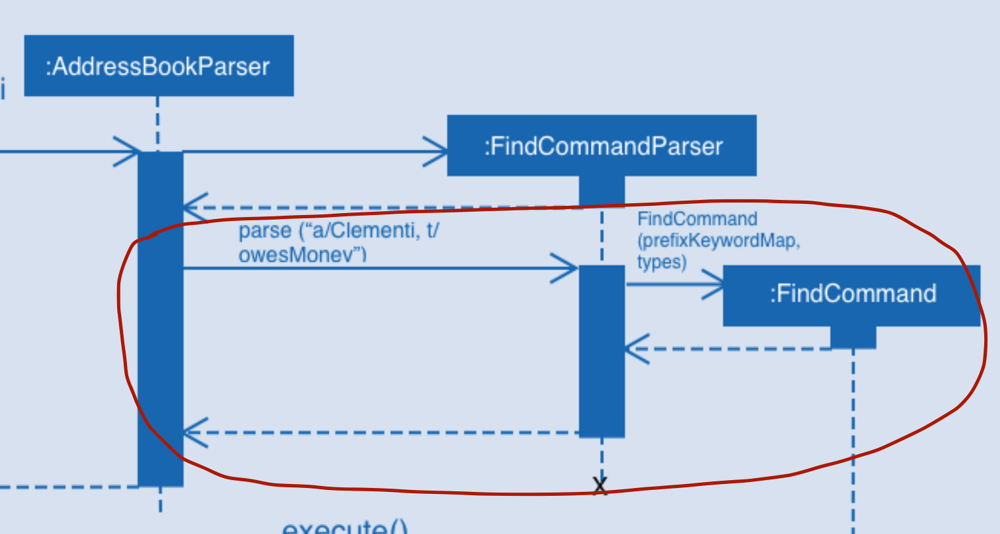

# UML Class diagrams
A class diagram captures the structure of the software design but not the **behavior**.

## Steps
1. Think of all the possible components eg. Data, File, etc etc
2. See which one can be *abstracted* or turned into an *interface* then combine them using **interface dependency arrow**
3. Combine the rest using associations
4. Fill in multiplicities *for both sides*
5. Convert some of the associations to compositions
6. Fill in solid triangle notation with description

# UML Object diagram
Used to model object structures.

## Steps
1. Identify the objects (eg. [Betty:Person], [Adam:Person])
2. Combine using associations
3. Fill in multiplicities
4. Convert some associations to compositions
5. Fill in solid triangle notation with desc

# UML Sequence diagram
A UML sequence diagram captures the interactions between multiple objects for a given scenario.

## Steps
1. Identify classes/ objects
2. Always start from person interacting with the GUI then Logic component
3. Draw them out in sequence from left to right
4. Make sure to identify method calls and make sure we dont span an arrow from the constructor of an object if its not supposed to span from there but a method within the object  
  
`Notice how FindCommandParser does not automatically instantiate FindCommand in its constructor`

5. Use solid arrows to represent method calls/ object creation, use dotted arrows for return values
6. Write in names to method calls on the arrows and returns on the dotted arrows
7. Fill in any conditionals
8. Fill in any loops 

# Object oriented domains

A class diagram used to model objects in the problem domain. eg. snakes and ladders, we have objects such as board, snek, player, dice etc etc.  
In this case we do not consider how the code should be like.

## Differences

- OO Domains do not show navigability (the arrow -->, which class knows about which class)
- OO Domains is about the problem domain not the solution domain (eg. we rule out stuff like database, eventsCenter, modelManager classes, facade classes)

## Similarities
- Both are UML diagrams

## Steps to think of one
1. Think of all the entities used in the problem first eg. chessboard, squares, players, chess pieces
2. Link them up based on what associates to what
3. Draw the small solid triangle notation with description
4. Fill in multiplicity
5. Convert some of the associations to compositions eg. chessboard to squares

