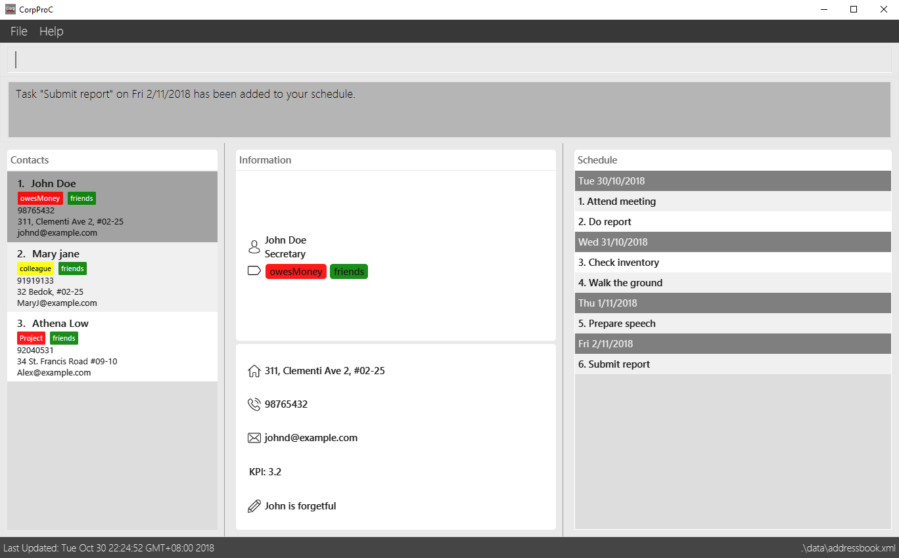

= CorpPro
ifdef::env-github,env-browser[:relfileprefix: docs/]

https://travis-ci.com/CS2113-AY1819S1-W12-3/main[image:https://travis-ci.com/CS2113-AY1819S1-W12-3/main.svg?branch=master[Build Status]]
https://ci.appveyor.com/project/lws803/main[image:https://ci.appveyor.com/api/projects/status/3511rw6gjy1r5i6o?svg=true[Build status]]
https://coveralls.io/github/CS2113-AY1819S1-W12-3/main?branch=master[image:https://coveralls.io/repos/github/CS2113-AY1819S1-W12-3/main/badge.svg?branch=master[Coverage Status]]
//https://gitter.im/se-edu/Lobby[image:https://badges.gitter.im/se-edu/Lobby.svg[Gitter chat]]

ifdef::env-github[]

endif::[]

CorpPro is a Java desktop application that act as your one stop address book for all contacts management needs. It contains all the essential functionality to improve your productivity.

== Site Map

* <<UserGuide#, User Guide>>
* <<DeveloperGuide#, Developer Guide>>
* <<AboutUs#, About Us>>
* <<ContactUs#, Contact Us>>

== Acknowledgements

* Some parts of this sample application were inspired by the excellent http://code.makery.ch/library/javafx-8-tutorial/[Java FX tutorial] by
_Marco Jakob_.
* Libraries used: https://github.com/TestFX/TestFX[TextFX], https://bitbucket.org/controlsfx/controlsfx/[ControlsFX], https://github.com/FasterXML/jackson[Jackson], https://github.com/google/guava[Guava], https://github.com/junit-team/junit5[JUnit5]

== Licence : link:LICENSE[MIT]

